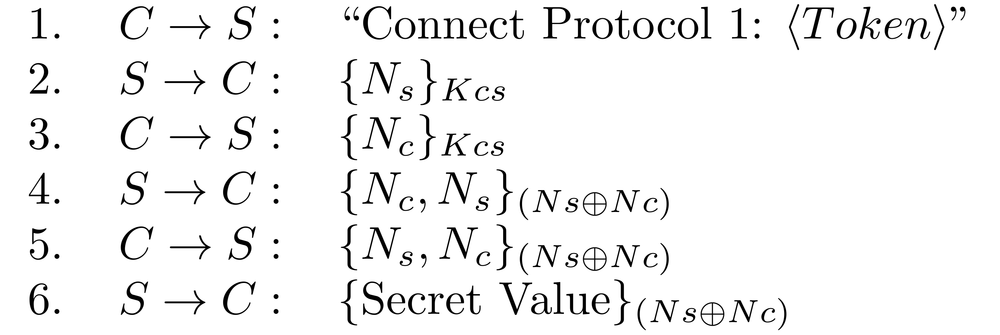

Protocol Analysis, Protocol 1
=============================

In this protocol, a client C and server S share a symmetric key Kcs, this key is only known
to the server and client. This long term key is used to set up a session key, and this session
key is then used by the server to send a secret value to the client:

1. C → S : "Connect Protocol 1: <Token>"
2. S → C : {Ns}_Kcs
3. C → S : {Nc}_Kcs
4. S → C : {Nc, Ns}_(Ns ⊕ Nc)
5. C → S : {Ns, Nc}_(Ns ⊕ Nc)
6. S → C : {Secret Value}_(Ns ⊕ Nc)

The client starts a run of the protocol by sending the bytes of the ASCII for "Connect
Protocol 1: <Token>", (where <Token> is your exercise token) to the server.
E.g. "Connect Protocol 1: 5HQUUD45". 
The server then generates a nonce and sends it to the client encrypted with the key Kcs. 
The client must reply with a challenge of its own for the server: the nonce Nc encrypted 
with the key Kcs. The session key is the xor of the two nonces. The encryption used is 
128-bit AES in ECB mode with PKCS5 padding and the nonces are 128 bits.

The idea of this protocol is that only the server and the client know the key Kcs, so
only they know the nonces, which in turn should mean that only the client and server can
know the session key. Steps 4 and 5 let the client and the server prove to each other that
they know the key, with the aim of providing mutual belief in the session key (Ns ⊕ Nc).
Unfortunately this protocol has a security flaw and does not achieve these aims.

Task
----
Analyse this protocol and find an attack that will let you learn the secret value from the
server without having to know the key Kcs. Implement your attack and test it locally against
the provided server code. Once you are satisfied that it works, run it against the server 
running on ??? port ???. The real server message will include a flag, submit this flag to the
flag submission site ???and submit your attack code to Canvas???.
Implement your attack in Java. You can use the supplied server code as a model and to help 
you understand how to write your attack.
