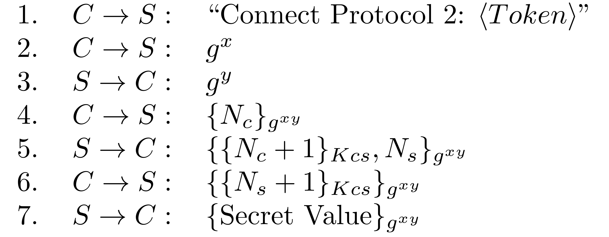

Protocol Analysis, Protocol 2
=============================

In this protocol, as above, a client C and a server S share a symmetric key Kcs, this key
is only known to the server and client. This long term key is used to set up a session key,
this session key is then used by the server to send a secret value to the client:

1. C → S : "Connect Protocol 2: <Token>"
2. C → S : g^x
3. S → C : g^y
4. C → S : {Nc}_g^xy
5. S → C : {{Nc + 1}_Kcs, Ns}_g^xy
6. C → S : {{Ns + 1}_Kcs}_g^xy
7. S → C : {Secret Value}_g^xy

The client starts a run of the protocol by sending the bytes of the ASCII for "Connect
Protocol 2: <Token>", (where <Token> is your exercise token) to the server.
E.g. "Connect Protocol 2: 5HQUUD45". 
In this protocol, the client and the server use Diffie-Hellman to set up a key based on
g^xy. They check who is on the other end of this channel by exchanging nonce challenges.
The idea here is that, given that only the server and the client know the key Kcs, then,
given the challenge Nc, only the server can produce {Nc + 1}Kcs and given the challenge Ns,
only the client can produce {Ns + 1}Kcs . However the protocol is flawed and an attacker
can learn the secret value without knowing the key Kcs.

The encryption used is 128-bit AES in ECB mode with PKCS5 padding and the nonces are ints. 
g^x and g^y are sent as public key certificates; as these get vary in length, the lengths
of the certificates are sent as an int before the certificates. Only the first 128-bits of 
g^xy are used to make the AES key.

The idea here is that only the server and the client know the key Kcs so only they know
the nonces which in turn should mean that only the client and server can know the session
key. Step 5 and 6 let the client and the server prove to each other that they know the
key, with the aim of providing mutual belief in the key. Unfortunately this protocol has a
security flaw and does not achieve these aims.

Task
----
Analyse this protocol and find an attack that will let you learn the secret message from the
server without having to know the key Kcs (N.B. as you cannot observe any traffic from
the client therefore this cannot be a man in the middle attack).
You've been provided with the code for the server (minus the key and the flag). The values 
of p and g for Diffie-Hellman can be found in the server code.
Implement your attack and test it locally against the provided server code. Once you are
satisfied that it works, run it against the server running on ??? port ???. The real 
server message will include a flag, submit this flag to the flag submission site ???and submit 
your attack code to Canvas???.
Implement your attack in Java. You can use the supplied server code as a model and to help 
you understand how to write your attack.
